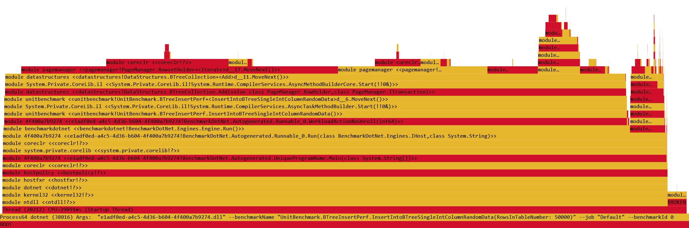
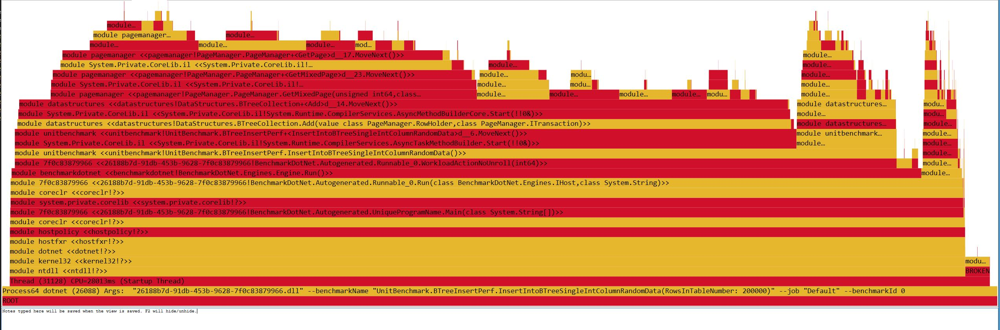

This is the starting point for inserting random keys into btree.

| Method | RowsInTableNumber | Mean |
|--------|----------|-------------|
| InsertRandomData | 10000 | 217.3 ms|
| InsertRandomData	| 50000	            | 1,236.9 ms	|
| InsertRandomData	| 100000	        | 2,759.3 ms	|
| InsertRandomData	| 200000	        | 6,043.7 ms	|

This is rather bad, but also the initial implementation only aimed at correctness.
Let's try to optimize the perf. The goal should be 1M inserts < 1s (~30X).

Just to add, measurements at this point are pretty lose - e.g. I will be writing this while the tests are running and eating precious CPU. Tests are run on amd 1600x, 32gb of ram and m2 ssd.

So let's start with the flame graph.

We can see that the most of the time is getting spent in RowsetHolder iterate method.

This is the current implementation:

        public IEnumerable<RowHolder> Iterate(ColumnInfo[] columnTypes)
        {
            for (int i = 0; i < this.maxRowCount; i++)
            {
                if (BitArray.IsSet(i, this.storage.Span))
                {
                    RowHolder rowHolder = new RowHolder(columnTypes);
                    GetRow(i, ref rowHolder);
                    yield return rowHolder;
                }
            }
        }

This indeed is super slow. We are allocating individual RowHolder for each row to be returned which puts a lot of pressure on memory allocation.

This code is getting called from:

        public override IEnumerable<RowHolder> Fetch(ITransaction tran)
        {
            tran.VerifyLock(this.pageId, LockManager.LockTypeEnum.Shared);

            lock (this.lockObject)
            {
                return  this.items.Iterate(this.columnTypes);
            }
        }

Idea here is to minimize needless copying and keep everything on RowSetHolder level.
Since btree implementation currently can't host duplicates we check for duplicates on every insert. This turns to be pretty costly. Instead of doing full fetch and then iterate and call functor on each element we will go with something like this:

        public bool ElemExists<T>(ColumnInfo[] columnTypes, T elem, int columnPos) where T : unmanaged, IComparable
        {
            ushort colPosition = 0;
            for (int i = 0; i < columnPos; i++)
            {
                colPosition += columnTypes[i].GetSize();
            }

            for (int i = 0; i < this.maxRowCount; i++)
            {
                if (BitArray.IsSet(i, this.storage.Span))
                {
                    ushort position = (ushort)(i * this.rowSize + this.dataStartPosition);

                    fixed (byte* ptr = this.storage.Span)
                    {
                        if ((*(T*)(ptr + position + colPosition)).CompareTo(elem) == 0)
                        {
                            return true;
                        }
                    }
                }
            }

            return false;
        }

With this fix these are the new values:

|                                   Method | RowsInTableNumber |       Mean |    Error |   StdDev |
|----------------------------------------- |------------------ |-----------:|---------:|---------:|
| InsertIntoBTreeSingleIntColumnRandomData |             10000 |   106.5 ms |  1.70 ms |  1.74 ms |
| InsertIntoBTreeSingleIntColumnRandomData |             50000 |   669.5 ms | 12.04 ms | 11.26 ms |
| InsertIntoBTreeSingleIntColumnRandomData |            100000 | 1,650.9 ms | 31.48 ms | 38.66 ms |
| InsertIntoBTreeSingleIntColumnRandomData |            200000 | 3,622.4 ms | 42.50 ms | 39.76 ms |

which is ~2x improvement.

Given that here we are working with concrete types we don't have the luxury of comparing RowHolder. Instead we need to resolve each template.

Tried to optimize RowsetHolder::InsertOrdered to avoid RowHolder alloc. Got ~10%.

|                                   Method | RowsInTableNumber |        Mean |     Error |    StdDev |
|----------------------------------------- |------------------ |------------:|----------:|----------:|
| InsertIntoBTreeSingleIntColumnRandomData |             10000 |    90.98 ms |  1.795 ms |  3.000 ms |
| InsertIntoBTreeSingleIntColumnRandomData |             50000 |   556.63 ms |  6.904 ms |  5.391 ms |
| InsertIntoBTreeSingleIntColumnRandomData |            100000 | 1,379.85 ms | 27.219 ms | 39.036 ms |
| InsertIntoBTreeSingleIntColumnRandomData |            200000 | 3,208.92 ms | 36.132 ms | 32.030 ms |

Next big chunks are for non-leaf iter and nlogn for insert into tree logic. Idea would be to always try to keep the page compact, without free space between the pages.

Removed btree RowHolder fetch. Replaced with iteration and tuple fetch:

|                                   Method | RowsInTableNumber |        Mean |     Error |    StdDev |
|----------------------------------------- |------------------ |------------:|----------:|----------:|
| InsertIntoBTreeSingleIntColumnRandomData |             10000 |    69.08 ms |  0.896 ms |  0.839 ms |
| InsertIntoBTreeSingleIntColumnRandomData |             50000 |   402.94 ms |  1.798 ms |  1.502 ms |
| InsertIntoBTreeSingleIntColumnRandomData |            100000 |   893.23 ms |  8.578 ms |  7.163 ms |
| InsertIntoBTreeSingleIntColumnRandomData |            200000 | 2,063.97 ms | 31.334 ms | 26.166 ms |

Also removing 10000 rows from the measurement. Don't care about benchmarks that are <100ms.

We are now at 100k/s. 10x to go.

After implementing binary search on btree traversal:
|                                   Method | RowsInTableNumber |       Mean |    Error |   StdDev |
|----------------------------------------- |------------------ |-----------:|---------:|---------:|
| InsertIntoBTreeSingleIntColumnRandomData |             50000 |   346.4 ms |  5.63 ms |  4.39 ms |
| InsertIntoBTreeSingleIntColumnRandomData |            100000 |   748.1 ms | 11.31 ms | 10.03 ms |
| InsertIntoBTreeSingleIntColumnRandomData |            200000 | 1,676.4 ms | 24.03 ms | 18.76 ms |

Let's see the flame graph now:

ElementsExists is taking a lot. It is still using just iteration so switching to binary search should help.
InsertOrdered is another low hanging optimization in rowsetholder. Again switching to binary search should help.

Interesting part is that RecordUsageAndEvict is also super slow.

After ElementsExists optimization:
|                                   Method | RowsInTableNumber |       Mean |   Error |  StdDev |
|----------------------------------------- |------------------ |-----------:|--------:|--------:|
| InsertIntoBTreeSingleIntColumnRandomData |             50000 |   219.4 ms | 4.38 ms | 4.68 ms |
| InsertIntoBTreeSingleIntColumnRandomData |            100000 |   487.0 ms | 3.34 ms | 2.79 ms |
| InsertIntoBTreeSingleIntColumnRandomData |            200000 | 1,200.3 ms | 5.32 ms | 4.45 ms |

After insert with binary search:

|                                   Method | RowsInTableNumber |     Mean |   Error |  StdDev |
|----------------------------------------- |------------------ |---------:|--------:|--------:|
| InsertIntoBTreeSingleIntColumnRandomData |             50000 | 134.7 ms | 2.15 ms | 2.21 ms |
| InsertIntoBTreeSingleIntColumnRandomData |            100000 | 315.2 ms | 5.77 ms | 5.12 ms |
| InsertIntoBTreeSingleIntColumnRandomData |            200000 | 868.2 ms | 3.62 ms | 3.39 ms |

At this point btree specific code is no longer top hitter on the flame graph:

At this point we wil need to optimize usage recorder in page manager. All in all we need ~5x improvement and we still have a chance to get a boost from concurrency.
1M inserts per seconds seems pretty tangible. 

After page eviction policy optimizations:

|                                   Method | RowsInTableNumber |     Mean |   Error |  StdDev |
|----------------------------------------- |------------------ |---------:|--------:|--------:|
| InsertIntoBTreeSingleIntColumnRandomData |             50000 | 115.5 ms | 1.84 ms | 1.81 ms |
| InsertIntoBTreeSingleIntColumnRandomData |            100000 | 260.5 ms | 2.38 ms | 2.11 ms |
| InsertIntoBTreeSingleIntColumnRandomData |            200000 | 614.5 ms | 4.29 ms | 4.01 ms |

It's time to remove 50k test and add 1/2M test (which feels nice).

|                                   Method | RowsInTableNumber |       Mean |    Error |   StdDev |
|----------------------------------------- |------------------ |-----------:|---------:|---------:|
| InsertIntoBTreeSingleIntColumnRandomData |            100000 |   271.5 ms |  5.15 ms |  8.02 ms |
| InsertIntoBTreeSingleIntColumnRandomData |            200000 |   613.5 ms | 10.66 ms |  9.45 ms |
| InsertIntoBTreeSingleIntColumnRandomData |            500000 | 1,802.1 ms | 12.71 ms | 11.89 ms |

Also flame graph is now again different and it looks a bit harder to tackle from now on. PageManager still seems to be the main culprit.

Ok, actually the next offender was logging. There were a couple of log.Debug statements in pagemanager for fetching every page that took a lot of time.

|                                   Method | RowsInTableNumber |       Mean |    Error |   StdDev |
|----------------------------------------- |------------------ |-----------:|---------:|---------:|
| InsertIntoBTreeSingleIntColumnRandomData |            100000 |   204.4 ms |  4.03 ms |  4.14 ms |
| InsertIntoBTreeSingleIntColumnRandomData |            200000 |   466.1 ms |  3.73 ms |  3.31 ms |
| InsertIntoBTreeSingleIntColumnRandomData |            500000 | 1,374.4 ms | 26.82 ms | 44.81 ms |

Interestingly page evict is still pretty high...

Let's now start using real transactions.

|                                                 Method | RowsInTableNumber |       Mean |    Error |   StdDev |
|------------------------------------------------------- |------------------ |-----------:|---------:|---------:|
| InsertIntoBTreeSingleIntColumnRandomDataBulkSingleTran |            100000 |   368.8 ms |  7.09 ms |  9.46 ms |
|  InsertIntoBTreeSingleIntColumnRandomDataTranPerInsert |            100000 |   807.7 ms |  5.11 ms |  4.78 ms |
|      InsertIntoBTreeSingleIntColumnRandomDataDummyTran |            100000 |   199.5 ms |  3.95 ms |  3.50 ms |
| InsertIntoBTreeSingleIntColumnRandomDataBulkSingleTran |            200000 |   813.8 ms |  7.23 ms |  6.77 ms |
|  InsertIntoBTreeSingleIntColumnRandomDataTranPerInsert |            200000 | 1,979.6 ms | 37.46 ms | 69.44 ms |
|      InsertIntoBTreeSingleIntColumnRandomDataDummyTran |            200000 |   491.1 ms |  8.51 ms | 10.46 ms |
| InsertIntoBTreeSingleIntColumnRandomDataBulkSingleTran |            500000 | 2,329.6 ms | 22.86 ms | 17.84 ms |
|  InsertIntoBTreeSingleIntColumnRandomDataTranPerInsert |            500000 | 5,442.3 ms | 63.18 ms | 59.10 ms |
|      InsertIntoBTreeSingleIntColumnRandomDataDummyTran |            500000 | 1,395.3 ms |  9.22 ms |  8.17 ms |

Tran path is not optimized at all. We can see that using one tran to do all the inserts adds ~2X overhead (which is kind of fine) and that one tran per insert introduces 4X overhead (which includes flush to disk on every tran, which again is ok-ish).